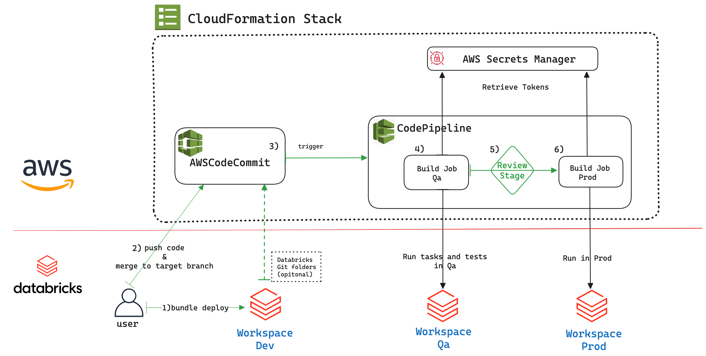
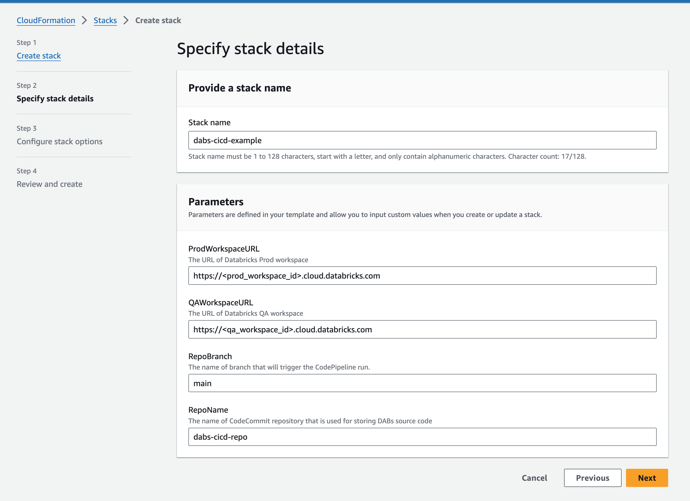
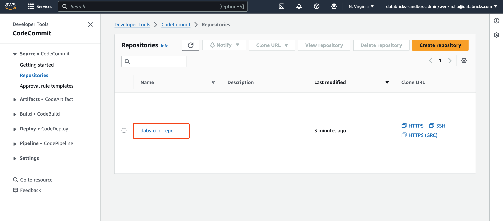
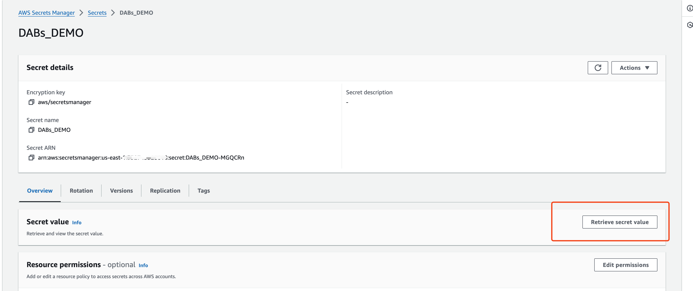
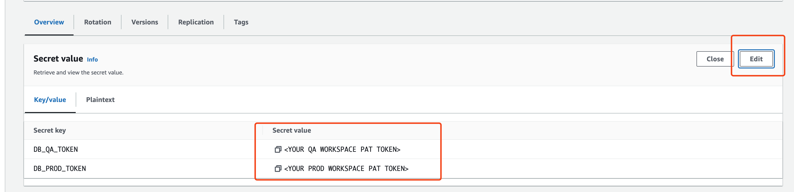
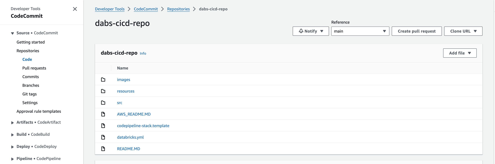
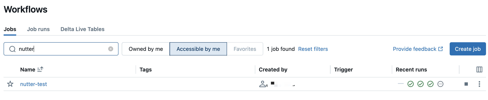

# DABs CI/CD Pipeline Example on AWS

This example demonstrates how to set up a CI/CD pipeline for deploying Databricks jobs and pipelines using Databricks Asset Bundles (DABs) on the AWS platform.

## Solution Introduction

This solution provides an AWS CloudFormation template to provision the CI/CD pipeline resources on AWS, including a CodeCommit repository, CodePipeline, AWS Secret Manager and IAM resources. The CI/CD pipeline retrieves the Databricks PAT token from the registered AWS Secrets Manager to authenticate to the target workspaces. It then deploys the sample Databricks job and pipeline using the Databricks bundle template and Python sample code in this repository.

## Prerequisites

1. All Databricks workspaces (local dev workspace, QA workspace, and Prod workspace) and PAT tokens used in this solution are created outside of the solution template.
2. The AWS user or role has **sufficient permissions** to deploy the CloudFormation template and create the required resources.
3. The sample AWS CloudFormation template creates the AWS Secrets Manager secret pair but does not upload the actual token value. Upload the secret value via the console or API before running the pipeline.
4. The workspaces used in this demo must have access to the public internet to run `pip install` for downloading public resources, such as [nutter](https://github.com/microsoft/nutter).
5. For the introduction to Databricks Asset Bundles and Databricks CLI, please refer to:
    - [Databricks Asset Bundles Documentation](https://docs.databricks.com/en/dev-tools/bundles/index.html)
    - [Databricks CLI Installation Guide](https://docs.databricks.com/en/dev-tools/cli/install.html)

## High-level Architecture Diagram

## High-level Workflow

1. Users can use DABs `databricks bundle` commands to deploy the code in a dev workspace, and use this workspace to debug the notebook code and the DABs YAML template code.
     - ( *Optional* ) Users can also directly associate the dev workspace with the remote repository using the [Databricks Git integration](https://docs.databricks.com/en/repos/index.html) to push code or create pull requests.
2. After debugging, users can push the local DABs folder/code to the AWS CodeCommit remote repository using Git, and then merge the code into the target branch (e.g., "main") via a Pull Request in AWS CodeCommit.
3. Once the PR is merged into the target branch, it triggers the AWS CodePipeline.
4. In the QA build stage of the AWS CodePipeline, the pipeline retrieves the QA workspace PAT token from AWS Secrets Manager for authentication and deploys the resources defined in the DABs template to the QA workspace. In this sample solution, the QA stage runner also runs nutter tests to perform a sample test on one of the notebook functions.
5. If the QA stage completes successfully, it moves to the manual review stage. This stage requires manual approval from a reviewer with the appropriate permissions to promote the code to production.
6. Upon approval, the Prod stage runner retrieves the Prod workspace PAT token and deploys the resources defined in the DABs template to the Prod workspace, such as jobs or DLT pipelines.

## Deployment Instruction

1. **Create CloudFormation Stack**:
    - Use the sample `codepipeline-stack.template` provided in this repository to create a stack in CloudFormation in your chosen AWS region. For example, if all your workspaces are in the us-east-1 region, it is recommended to create the CloudFormation stack in this region as well.
    - Review and fill in the CloudFormation stack parameters.
    - 
    - On the next page, use the default CloudFormation options, confirm the creation of IAM roles, and create the stack.
    - 

2. **Upload Databricks PAT Tokens to AWS Secrets Manager**:
    - After the CloudFormation stack is successfully created, you will find the newly created repository in the CodeCommit service page and a "DABS_DEMO" secret in the AWS Secrets Manager.
    - Use an AWS user or role with sufficient permissions to store the Databricks PAT tokens from your Dev and QA workspaces in the corresponding secret values. [Databricks PAT Token Documentation](https://docs.databricks.com/en/dev-tools/auth/pat.html)
    - 
    - 

3. **Connect to the CodeCommit Repository**:
    - Connect to the CodeCommit repository created by the CloudFormation stack. You can directly commit and push to the branch that triggers the pipeline, or you can commit to a development branch first and then create a Pull Request to merge your changes into the trigger branch (in this example, we use the "main" branch).
    - Note: Before pushing the code to the remote repository, ensure that the `databricks.yml` and the Python notebooks are correctly configured.
    - 

4. **Trigger the CI/CD Pipeline**:
    - After pushing the code to the trigger branch, the CodePipeline run will be automatically triggered. Click "View details" on each stage to review the runner execution log.
    - [Runner Output Example](./images/runner_log.png)

5. **Manual Approval**:
    - Once the staging phase is completed, click "Approve" in the manual review stage to promote the pipeline to the production stage.
    - [Review and Promote](./images/review.png)

6. **Production Deployment**:
    - After the final "Production" stage is completed, you can view the runner execution output and logs by clicking "View details."

7. **Review Databricks Resources**:
    - You can review the deployed resources by logging into the Dev and QA workspaces in Databricks.
    - 

## Clean Up

1. Delete the resources created in the Databricks workspace, either through the console or using the Databricks CLI.
2. Delete the CloudFormation stack from your AWS account.